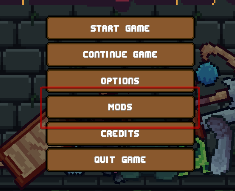
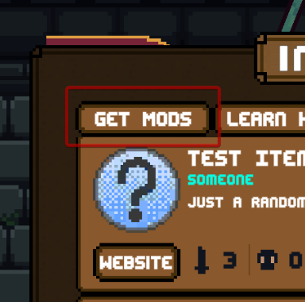
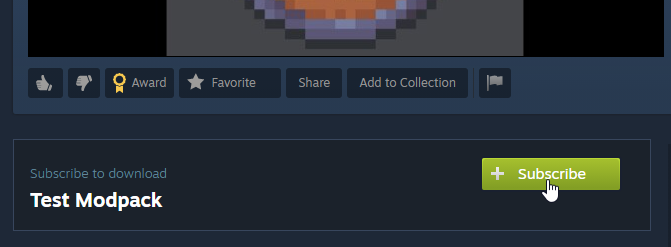
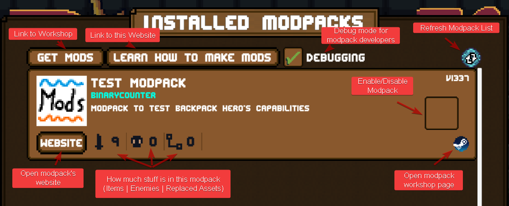
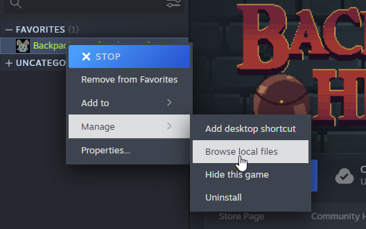

# Installing Mods

## Installing Mods through Steam Workshop

If you own the game on Steam, the easiest way to install mods is through the Workshop.

1. In the Main Menu of the game, navigate to the Workshop. 

 
2. Search through the library of workshop mods to find interesting stuff. Once you have found what you are looking for, press "Subscribe" to download the modpack. To uninstall, simply unsubscribe. 
 
3. In-game, you will see the workshop mod you subscribed to in the list of installed mods. (You might need to refresh the menu). Here you can enable and disable mods you have subscribed to. 

## Installing Mods manually

1. Find the "Mods" folder within the folder where the game is installed. If you're using Steam, you can get to this folder by right-clicking on the game in your Steam library and navigating to `Manage->Browse local files`. 
  (If your Mods folder is missing, start the game once to create it)
2. Extract the mod you want to install to this folder. Make sure to extract it in a way so that all your files are contained within a folder with the name of your modpack, not directly within the Mods folder, but also not nested within another folder. 
3. 3. In-game, you will see your mod in the list of installed mods. (You might need to refresh the menu). Here you can enable and disable mods. 
