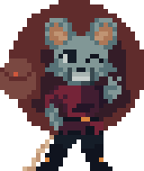

# Welcome to Backpack Hero Modding

This website provides information on how to create and install mods for the game "Backpack Hero".

If you're new to making mods, make sure to check out [Getting Started](How_to_Create_Mods/Getting_Started.md) and check out our [VSCode extension](https://marketplace.visualstudio.com/items?itemName=TeamBackpack.backpack-hero-modding).

If you're here because you want to download and install mods, check out [Installing Mods](Installing Mods.md) or go directly to the [Steam Workshop](https://steamcommunity.com/app/1970580/workshop/)

---
This website will grow and evolve as mod support is expanded and improved. If you wish to contribute to this website, please do not hesitate to contact @BinaryCounter on Discord or submit a pull request to our [Github repository](https://github.com/BackpackHero/ModDocs).

**If you are experiencing bugs, need help or just want to chat about your mods, join our [Discord Server](https://discord.gg/v7dJYk6gtw)!**

---

## Mod Support Status

Currently mod support is limited to creating:

- Items
- Manastones
- Carvings
- Curses
- Relics.
  
  Coming very soon:

-  Modifying base game items
-  Pouches
-  Pets
-  Components 

Planned for the future:

- Texture Packs and Sound Packs
- Enemies
- NPCs and Events
- Challenges
- Dungeons
- Javascript API for even more freedom

*This is all subject to change, none of this is final.*